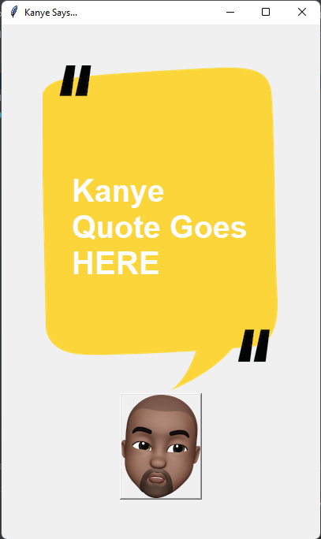

# Python-kanye-quote-app
This simple GUI base python program to provide you quotes on click on kanye each and every time different as API is used in it. 

Click on kayne emoji 😛 get new quote everytime.

## How to use 
1. download all files and install python in your system
2. make sure you install all required library in project
2. run main.py and enjoy

Thanks and please reach out me if find any bugs or suggestions.

😁😊
╰(*°▽°*)╯
